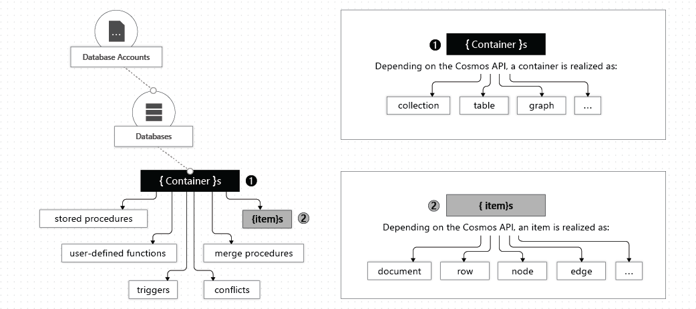
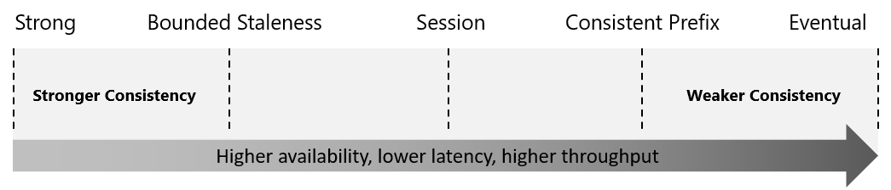

# Explore Azure Cosmos DB

## Key Benefits
- **Fully managed NoSQL** database with low latency, elastic scalability, and high availability.
- Globally distributed — data can be placed close to users in any Azure region.
- Add/remove regions **without pausing or redeploying** your application.

### Global Distribution Benefits (Multi-Master)
- Unlimited elastic read/write scalability.
- **99.999%** read and write availability worldwide.
- Reads and writes served in **< 10 ms** at the 99th percentile.
- Automatic failover — if one region goes down, others handle requests seamlessly.

---

## Resource Hierarchy

```
Azure Subscription
  └── Cosmos DB Account (max 50 per subscription; DNS name)
        └── Database (namespace/management unit)
              └── Container (fundamental unit of scalability — stores data)
                    └── Items (documents, rows, nodes, edges, etc.)
```



### Account
- Fundamental unit of global distribution and high availability.
- Managed via Azure portal, CLI, or language SDKs.

### Database
- Analogous to a namespace.
- Unit of management for a set of containers.

### Container
- Fundamental unit of **scalability** — virtually unlimited throughput (RU/s) and storage.
- Scales **out** (horizontal) rather than up.
- Requires a **partition key** — routes data to the correct physical partition.
- **Physical partition**: up to 10,000 RU/s, 50 GB storage.
- **Logical partition**: up to 20 GB.

#### Throughput Modes
| Mode | Description |
|------|-------------|
| **Dedicated** | Reserved exclusively for that container (standard or autoscale). |
| **Shared** | Set at database level, shared across up to 25 containers (excluding dedicated ones). |

### Items
Representation varies by API:

| API | Item type |
|-----|-----------|
| NoSQL | Item |
| Cassandra | Row |
| MongoDB | Document |
| Gremlin | Node or Edge |
| Table | Item |

---

## Quick Reference — Learning Objectives
- [ ] Key benefits of Azure Cosmos DB
- [ ] Resource hierarchy: Account → Database → Container → Item
- [ ] Consistency levels (5 levels — choose per project need)
- [ ] Supported APIs and when to use each
- [ ] Request Units (RU/s) and cost impact
- [ ] Create Cosmos DB resources via Azure portal

---

## Consistency Levels

Azure Cosmos DB offers **5 consistency levels** as a spectrum — from strongest to weakest:



| Level | Guarantee | Best For |
|-------|-----------|----------|
| **Strong** | Linearizability — always reads the latest committed write. Never sees uncommitted/partial writes. | Financial transactions, critical data |
| **Bounded Staleness** | Reads lag behind writes by at most K versions **or** T time interval (whichever comes first). | Apps needing near-real-time consistency across regions |
| **Session** | Within a single client session: read-your-writes and write-follows-reads guaranteed. | Most common choice — user-specific data (shopping cart, profile) |
| **Consistent Prefix** | Reads never see out-of-order writes. Batch (transaction) writes are always visible together. | Apps that can tolerate lag but need ordered data |
| **Eventual** | No ordering guarantee. Replicas eventually converge. Weakest consistency. | High-throughput, order-insensitive data (likes, retweets, view counts) |

### Key Points
- Consistency levels are **region-agnostic** — apply regardless of number of regions or write configuration.
- Default consistency level is set at the **account level** and applies to all databases/containers.
- You can override per request if needed.
- **100%** of read requests are guaranteed to meet the chosen consistency level (per SLA).
- Writes are replicated to a minimum of **3 replicas** (in a 4-replica set) locally for levels weaker than Strong.

### Bounded Staleness — Two Config Options
- **K** — max number of versions (updates) the replica can lag.
- **T** — max time interval reads can lag behind writes.
> Most beneficial for **single-region write accounts with 2+ regions**.
